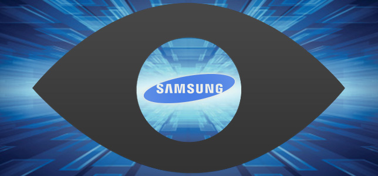
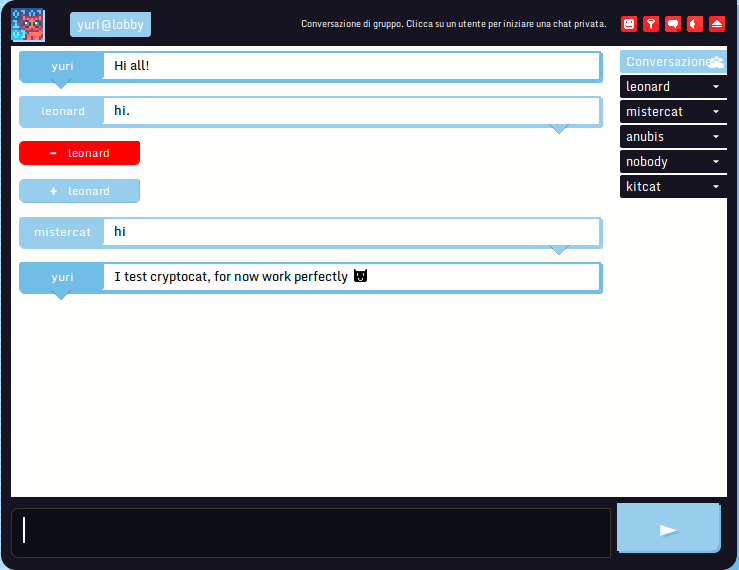
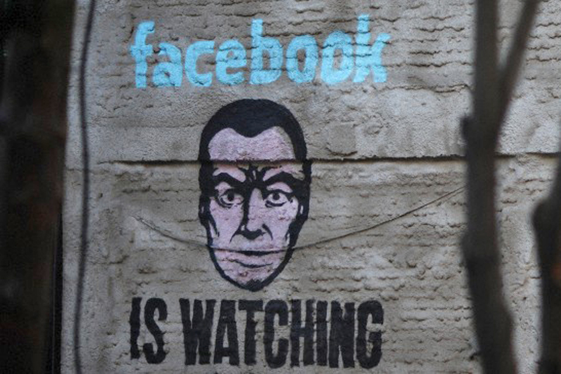

# Privacidad en Internet

# Motivación
  - Concientizar sobre la privacidad en Internet.

  
  
  - Difundir software libre para mantener la privacidad.
  - En la medida de lo posible se instalaran las aplicaciones básicas
  y se mostrará como usarlas.
  - Generar interés en los asistentes para ser más cuidadosos con su privacidad.

# Introducción
  - ¿Por qué esta presentación? ¿Para qué? Charla de sensibilización

  

  - ¿Cuánto conoce Google sobre nosotros?

  

  - Samsung Smart TV

  

  - ¿Sabías que tus búsquedas guardadas pueden ser legalmente solicitadas?

  https://www.google.com/transparencyreport/userdatarequests

  
  
  - Cuando una empresa te da gratis un servicio la mercancía sos vos
    (tus datos)

# Privacidad en Internet como Derecho Humano
  - Derecho al anonimato y utilizar el cifrado
      - Toda persona tiene derecho a comunicarse de forma anónima en
        Internet.
	  - Toda persona tiene derecho a utilizar la tecnología de
	  encriptación para garantizar una comunicación segura, privada y
	  anónima.

# Seguridad y privacidad en el navegador

  - Elección del navegador (Prohibido explorer!)
  - Extensiones (add-ons) del navegador
	- Privacy Badger: blocks spying ads and invisible trackers
	- HTTPS Everywhere: Encrypt the Web! Automatically use HTTPS
      security on many sites.
	- Disconnect: Make the web faster, more private, and more secure
	- Ghostery: Protect your privacy. See who's tracking your web
      browsing and block them
    - Disconnect+µBlock: para reeplazar Ghostery.
	- Blur (Formerly DoNotTrackMe): Protect your Passwords, Payments,
      and Privacy
	- AdBlock Edge: extension for blocking advertisements on the web.

# Buscadores (más allá de google)
  - DuckDuckGo: no-tracking privacy policy
  - StartPage: Web search results from Google in complete privacy
  - Ixquick: provides search results from over ten best search engines in full privacy
  - Metadata
  
# Comunicándonos en la red
  - Campaña: que vuelvan los alias
	- Caso cajera despedida del trabajo
  - Alternativas a WhatsApp
	- TextSecure
	- Wickr
	- telegram
  - Alternativas a gmail
	- ¿Que paso con lavabit?
	- Mantenidos por la comunidad
		- RiseUp
		- Autistici/Inventati
		- OpenMailbox
	- Enfocados en la seguridad desde el diseño
		- ProtonMail
		- Tutanota
  - Privacidad en el Mail
	- GPG
	- Thunderbird/Claws & Enigmail (para el manejo de las llaves)
  - Proteger el mail
    - ¿Escribirías tu nro de cel en un paredón?
	- No colocar la dirección en una web
  - Phishing

	

  - Mensajeria instantánea
	- Pidgin & OTR
	- Tox: Instant messaging, video conferencing, and more

	
	
	- Jabber/XMPP
	- Cryptocat: Chat with privacy. Group chat, file sharing, and more!

	
	
	- OTR
	- ricochet:  Anonymous peer-to-peer instant messaging 
	 
  - No todo es Facebook

	

  - Lista de correo
  - Reddit
  - Documentos Colaborativos
	- Etherpad: online editor providing collaborative editing in really real-time

  
  
  - Sincronizar archivos entre dispositivos
	- SyncThing
  - RetroShare (P2P: email descentralizado, compartir archivos, cifrado c/gpg)

# Anonimato on-line
  - Tor
	- Tor Browser
  - VPN
	- Bitmask
	- hola!

# Cifrado del sistema de archivo (mantener seguros determinados documentos)
  - ¿Qué pasó con TrueCrypt?
  - Zulucrypt (maneja volumenes previamente creado con TrueCrypt)
  - Tc-play
  - DiskCryptor
  - AES Crypt
  - Cryptsetup
  - CipherShed
  - VeraCrypt

# Colaboraron en la realización de esta presentación
*Iván Arce, Maximiliano Giraldes, Enrique Chaparro, Tess, @derechoaleer, Evelin Heidel, Teresa Sempere García, Pascual Calicchio*
  
# Referencias
  - [EFF Secure Messaging Scorecard](https://www.eff.org/es/secure-messaging-scorecard)
  - [Anonimato y cifrado (EFF)](https://www.eff.org/files/2015/03/18/anonimatoycifrado-eff-11.pdf)
  - [Cryptotarjetas](http://media.espora.org/mgoblin_media/media_entries/1495/Criptotarjetas_RanchoElectronico.pdf)
  - [Fundación Vía Libre](http://www.vialibre.org.ar)
  - [ONG Derechos digitales](https://www.derechosdigitales.org)
  - [Fundación Sadosky, Programa Seguridad en TIC](http://www.fundacionsadosky.org.ar/es/programas-proyectos/seguridad-en-tic)
  - [Autoprotección Digital Contra La Vigilancia (EFF)](https://ssd.eff.org/es)
  - [Carta de Derechos Humanos y Principios en Internet](http://diadeinternet.org/pdfs/Internet_Derechos_Principios.pdf)
  - [how much does google really know about you? (infografía)](http://www.visualistan.com/2015/02/how-much-does-google-really-know-about-you.html)
  - Charlas
	- [Think your email's private? Think again (ProtonMail)](http://www.ted.com/talks/andy_yen_think_your_email_s_private_think_again)
	- [Gerardo Richarte *(Gera)* en GarageLab 4 Post-Privacidad](https://vimeo.com/10965423)
  - [Breve compendio de noticias e info](http://www.scoop.it/IPcontrol)
  - [Derecho a Leer](http://derechoaleer.org)
  
#### Licencia
[CC BY 4.0](https://creativecommons.org/licenses/by/4.0/)

#### Contacto
*Lucas E. Bellomo* [@ucaomo](https://twitter.com/ucaomo)
